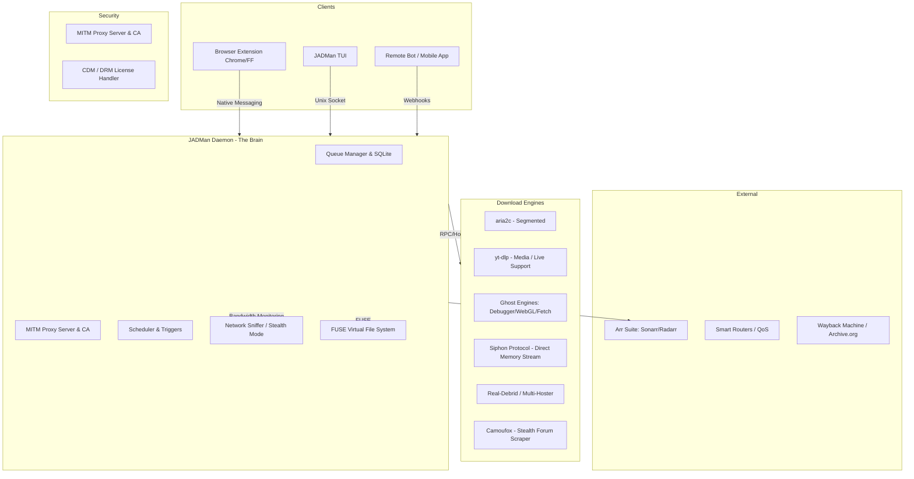

# JADMan (pronounced "Jade-man") — The Ultimate Media Orchestrator

JADMan is a terminal-native, daemon-driven download orchestrator designed for power users and home-server setups. It bridges the gap between manual downloading and fully automated media management.

---

## 🏛️ Updated Architecture

JADMan operates as a central **Rust Daemon** with high-bandwidth bridges to browsers, system TUIs, and external services.

---

## 🚀 Key Capabilities (Current & Planned)

### 1. Hybrid Engine Suite
- **Legacy Engines:** `aria2c` for segments, `yt-dlp` for video/audio.
- **Live Stream Support:** Native handling for Twitch/YouTube livestreams, including `live-from-start` recording.
- **Ghost Engines:** Advanced `DebuggerCapture`, `BrowserFetch`, and `WebGLCapture` (direct Canvas-to-Video recording) for bypassing modern stream encryption.
- **Stealth Mode:** Includes "Human-Mimicry" logic that simulates mouse movements and scrolls to bypass anti-bot detections (e.g., Cloudflare/Google).
- **Siphon Protocol:** A custom binary protocol that allows the browser to stream raw memory chunks (blobs) or recorded Canvas frames directly to the Rust daemon.
- **Stealth Scraper:** Integration with `Camoufox` to bypass anti-bot protections.

### 2. Security & Deep Inspection
- **Transparent Proxy:** Built-in MITM server with custom CA to decrypt and inspect HTTPS traffic.
- **CDM/DRM Support:** Scaffolding for `CdmStart` to handle encrypted media license requests.

### 3. Smart Bandwidth "Stealth" Mode (Future)
- **Context-Aware Throttling:** Automatically detects low-latency traffic (Gaming, Zoom) and throttles download speeds to 5% dynamically.
- **Router Sync:** Communicates with smart routers to balance home-wide internet traffic.

### 4. Media Automation & "Arr" Integration (Future)
- **Seedbox TUI:** A premium, keyboard-driven interface that manages both direct downloads and torrents.
- **Debrid Support:** Transparently converts Magnet/Torrent links to high-speed HTTP downloads via services like Real-Debrid.
- **Media Sync:** Native integration with Sonarr/Radarr for a "Missing Episode" dashboard.

### 5. Virtual File System (VFS) & Streaming (Future)
- **FUSE Mount:** Mounts active downloads as a local folder.
- **Sequential Priority:** Downloads the beginning of video files first, allowing you to watch a 4K movie in VLC while it's still 5% complete.

### 6. Link Graveyard (Future)
- **Resurrection:** Automatically hunts for `404 Not Found` files on the Internet Archive (Wayback Machine).

---

## 📂 Project Structure

- `crates/jadm-daemon`: The core brain (RPC, MITM, Engine management).
- `crates/jadm-tui`: The terminal interface (Ratatui, Syntax highlighting).
- `crates/jadm-common`: Shared types and protocol definitions.
- `extension/`: Chrome and Firefox 5-layer capture extensions.
